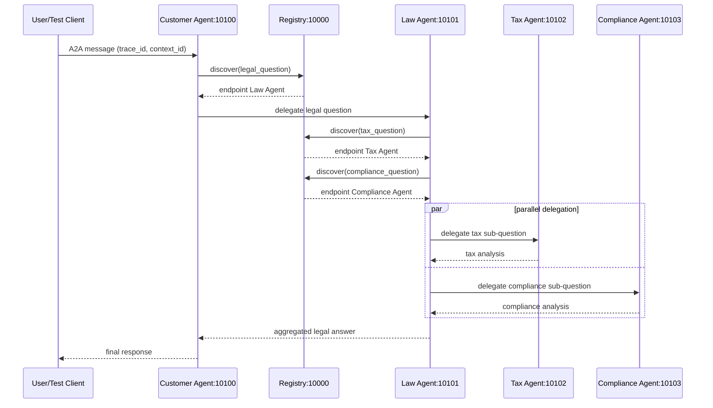

# Stage 5 Exercises (CODELAB Phan 5)

Tai lieu nay chot ket qua cho 3 bai tap cua Phan 5:
- 5.1 Trace request flow
- 5.2 Dynamic discovery failure test
- 5.3 Tax Agent concise behavior

## 5.1 Trace Request Flow

Gui request voi trace id ro rang:

```bash
.venv/bin/python test_client.py --trace-id trace-stage5-001
```

Trong logs, tim `trace=trace-stage5-001`.

Sequence diagram:



## 5.2 Dynamic Discovery Test (Tax Agent Down)

1) Dung rieng Tax Agent (giu cac service khac dang chay):

```bash
lsof -tiTCP:10102 -sTCP:LISTEN | xargs -r kill
```

2) Gui lai request:

```bash
.venv/bin/python test_client.py --trace-id trace-stage5-tax-down
```

3) Ky vong:
- Registry khong discover duoc `tax_question` (404).
- Law Agent van tra ket qua tong hop.
- Phan Tax se co fallback text: `Tax analysis unavailable...`.

## 5.3 Tax Agent Tra Loi Ngan Gon

Tax prompt da duoc doi trong `tax_agent/graph.py`:
- Gioi han <= 120 words
- 3-5 bullet points
- Tap trung vao exposure, authorities, liability, limitation
- Ket thuc bang 1 dong disclaimer ngan

Restart Tax Agent de ap dung prompt moi:

```bash
lsof -tiTCP:10102 -sTCP:LISTEN | xargs -r kill
.venv/bin/python -m tax_agent
```

